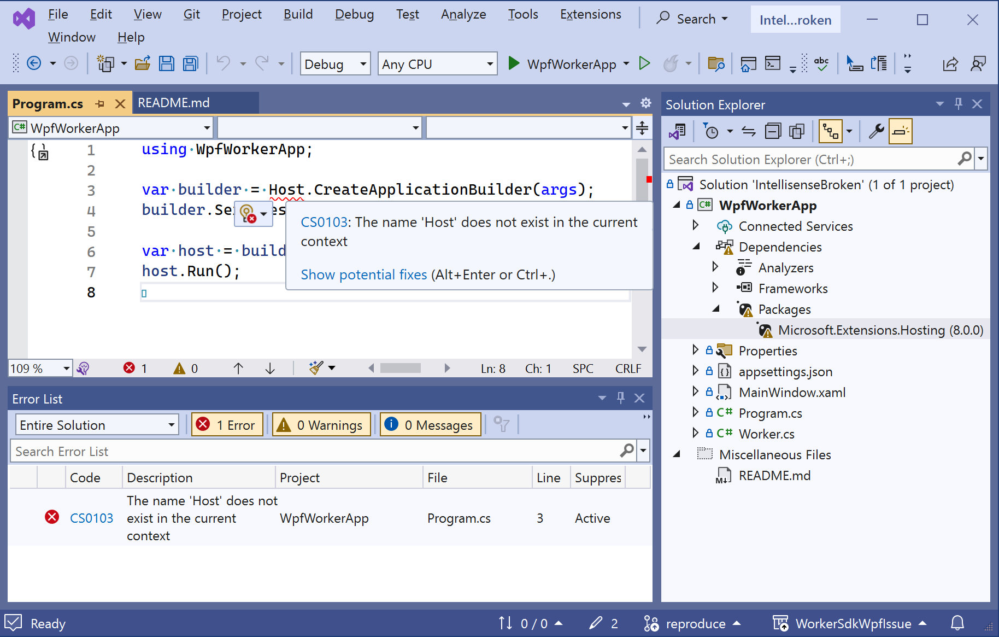
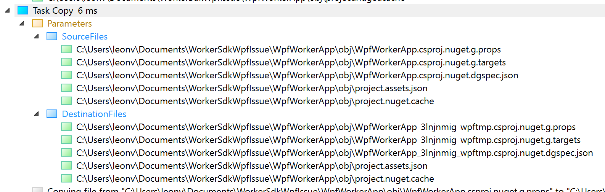

# WorkerSdkWpfIssue
This repository reproduces delete of `project.assets.json` when a project is build.

# Introduction
When using the `Microsoft.NET.Sdk.Worker` Sdk with
```
    <UseWPF>true</UseWPF>
```
then, during each build, the `project.assets.json` file is deleted. This causes IntelliSense in Visual Studio to fail:


Note that this file is created when the solution is opened, during package restore. After build, Visual Studio detects missing file (note the error icon for the `Microsoft.Extensions.Hosting` package), and IntelliSense can't resolve symbols anymore, since package references are broken.

# Cause

Using `Microsoft.NET.Sdk.Worker` Sdk (instead of `Microsoft.NET.Sdk`) causes import of `Microsoft.NET.Sdk.Publish.targets`.

A property reassignment in [Microsoft.NET.Sdk.Publish.targets line 87](https://github.com/dotnet/sdk/blob/6ced0bc9a370d3b2ed9fe3350a19cd86aa94d184/src/WebSdk/Publish/Targets/Microsoft.NET.Sdk.Publish.targets#L87) causes the `_InitialBaseIntermediateOutputPath` and `BaseIntermediateOutputPath` properties to become different (but still point to the same directory):
```
_InitialBaseIntermediateOutputPath = obj\
BaseIntermediateOutputPath = C:\Users\leon\Documents\WorkerSdkWpfIssue\WpfWorkerApp\obj\
```

See [Microsoft.WinFX.targets line 467](https://github.com/dotnet/wpf/blob/f3f1756e8f4808a8e0c3ff56f07aecb1b156e5c2/src/Microsoft.DotNet.Wpf/src/PresentationBuildTasks/Microsoft.WinFX.targets#L467): the `Delete` task deletes `project.assets.json` file, as it is contained in the `_DestGeneratedNuGetPropsAndTargets` items.

Because `_InitialBaseIntermediateOutputPath` and `BaseIntermediateOutputPath` properties differ, code at line [403](https://github.com/dotnet/wpf/blob/f3f1756e8f4808a8e0c3ff56f07aecb1b156e5c2/src/Microsoft.DotNet.Wpf/src/PresentationBuildTasks/Microsoft.WinFX.targets#L403) adds the file to `_DestGeneratedNuGetPropsAndTargets`, in preparation for the `Copy` task at line [408](https://github.com/dotnet/wpf/blob/f3f1756e8f4808a8e0c3ff56f07aecb1b156e5c2/src/Microsoft.DotNet.Wpf/src/PresentationBuildTasks/Microsoft.WinFX.targets#L408).

Note that this copy task copies 2 files on top of itself:


## BUG

Imo, the [Delete](https://github.com/dotnet/wpf/blob/f3f1756e8f4808a8e0c3ff56f07aecb1b156e5c2/src/Microsoft.DotNet.Wpf/src/PresentationBuildTasks/Microsoft.WinFX.targets#L467) task should not delete any file that is copied onto itself.
